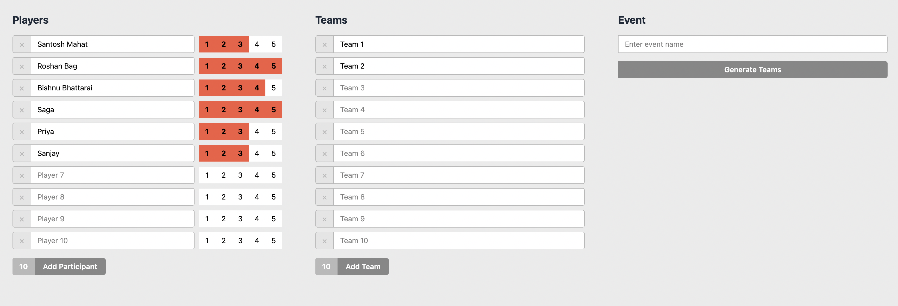

## Description
This is a fullstack application which is is a Random Team Generator. It is a service designed to create random groups from a list of participants. Additionally, it offers the option to generate balanced teams based on the skill levels of the participants. The application manages players
and teams effectively and employs a fair team generation algorithm that takes
player skill levels into account.

## Running the app

```bash
  # client

  $ cd client
  $ npm install
  $ npm run dev

  # upload this build folder into the extension tab of chrome
```

```bash
  # server

  $ cd server
  $ change .env.example to .env
  $ docker-compose up --build
```

## Database overview
  - Sequelize as an orm on the top of mysql is used as database.
  - No need to worry about setting up database locally, docker will do that for you :)
  - Team table
  - Player table
  - Event table
  - EventTeamPlayer table

## 📸 Screenshots

### 🖥️ Home Page


### 🖥️ Team Generation Page
